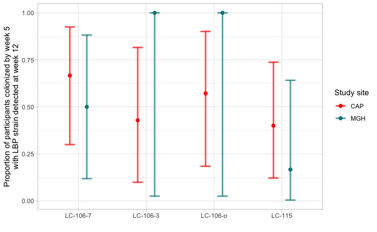

## PRIMARY paper - TODO

-   [ ] Proportion of participants with a positive primary outcome who still have detection at week 12
    -   [x] Compute it

    -   [x] Join the table "by arm" and "overall"

    -   [x] In the overall proportion, make one version without filtering for the Placebo arm (as is right now) and one version without the Placebo arm ("new todo")

    -   [x] Make a figure (see Figure 3a mock by Caroline): make it from the code, with CIs and using the actual colors, etc. (dot + CI)

        {width="427"}

    -   [ ] Add a supplementary table

    -   [ ] Fix numbers/language in main text
-   [ ] Risk ratio (RR) in Table 2 (Laura S!)
    -   [ ] Compute it (check which test and which CI formula/assumptions are most suited)
    -   [ ] Update the main table
    -   [ ] Fix numbers/language in main text
-   [ ] Applicator staining
    -   [x] Compute the numbers
    -   [ ] Add a supplementary table and/or figure
        -   [ ] Double-check that that the 2 participants that "have 6 doses" correspond to cases where they inserted the dose, but the tablet fell off. (and think about updating the `exposure` table to reflect these subtle different scenarios)
            -   [ ] I checked and it's not those participants.
    -   [x] Add a table with the % of participants with the following categories: 100% of stained applicators positive, \>50% of stained ..., and 0.
    -   [x] Make an additional analysis, filtering for participants who returned their complete set of applicators
    -   [ ] Fix numbers/language in main text
-   [x] In the two arms with 7 days of dosing, the average duration of time between final dose and the week 2 sampling visit was YYY (LC106) and YYY (LC115).
    -   [x] ==Message to Caroline/Disebo==: We don't think we have information about the time of the visit, so we assumed everyone came to the clinic around noon.
    -   [x] Answer from Caroline:
        -   [x] Make categoty :
            -   Day of the visit or day before
            -   More than one day ago
    -   [x] Compute it
    -   [x] Add numbers/language in main text
-   [ ] "Participants who achieved the primary outcome of LBP detection were less likely to have BV recurrence during the 12 week follow up: YY/YY vs. YY/YY who did not colonize (p = YY)."
    -   [x] Compute it
    -   [ ] Add numbers/language in main text
    -   [ ] Question/message to Caroline: the line before, careful with the language and the approach (cherry-picking and "discussion" in the results).
-   [ ] At YY of these visits remote from dosing, where an LBP strain was detected by metagenomics, LBP strains made up \> 50% of the community in YY (%), suggesting that if the LBP strains were retained they usually established dominance.
    -   [x] ==Question/message to Caroline==: which visits (and arms) exactly do you want to consider? It could be only for arms LC-106-7 and LC-115 visits at week 3-5 (for consistency with what comes before in that paragraph) OR visits week 3-5 for these two arms + visits at week 2-5 for the 2 other arms (LC-106-o and LC-106-3) (for a more general statement about "LBP dominance"). I imagine that the numbers would be highly similar for these two options, but let us know which one you want. For now, we felt that the first option was the least ambiguous given the preceding text, but we can change.
    -   [x] Compute it
    -   [x] Answer from Caroline: all active arms,
        -   LC-106-7 and LC-115 = week 3 to 5
        -   LC-106-o and LC-106-3 = week 2 to 5
-   [ ] Add numbers/language in main text

Once daily qPCR data is available

-   [ ] Using a threshold of detecting at least two LBP strains at \> YY copies/Y at a given visit, YY/YY people exposed to active study product had detection of LBP strains during dosing. The mean proportion of exposed days at which study product strains were detected was YY (Y-Y).
-   [ ] Among the people with Nugent \>= 7 post-MTZ, how many had a detectable LBP ... by qPCR

Figure 2

-   [x] Remove participant IDs (theme(axis.text.x = element_blank()))

-   [x] PP vs mITT: replace the "alpha" by a little star at the bottom of their line

-   [x] Add an ordering criterion such that non-Lacto taxa are sorted by Genus

-   [x] [likely needs to be changes in the VIBRANT-0-QC: `90-MAE-integration.html#creating-the-visit-visit_number-and-study_week-columns`] Change the labels of the vertical facets (visit):

    -   [ ] Screening
    -   [ ] Add. screening
    -   [ ] Day 0 (pre-MTZ)
    -   [ ] Week 1 (post-MTZ)
    -   [ ] Week 2 (post-SP)
    -   [ ] Week 3
    -   [ ] Week 4
    -   [ ] ....
    -   [ ] Week 12

-   [ ] change theme so it is more readable when printed

-   [x] y-axis: <u>R</u>elative abundance

-   [x] [not priority] try to do this in R

    

    hint: theme(strip.background.x = element_blank(), strip.text.x = element_blank()) + annotation(geom = rect...) + annotation(geom = label....)

In Manuscript

-   [x] Laura S to update affiliation
-   [x] Laura V to update affiliation
-   [x] Lara W in acknowledgments
-   [ ] Contributions:
    -   [x] add section
    -   [ ] copy-paste template
    -   [ ] add LS and LV

# OLD ---- VIBRANT primary trial analyses - TODO

1.  Raw to SE

-   [ ] Add the weekly VIRGO metagenomics (because the analysis is based on the relative abundances as estimated by metagenomics instead of 16S).

-   [ ]

-   [x] Checks and QC ➞ total mg reads

-   [x] Pour les simulations ➞ k_sanity: il ne devrait pas y avoir de NA "completely random" (soit manquant pour toute la visite, soit pas manquant ➞ 0).

-   [x] Aussi dans les simulations: ajouter des participants qui ne sont pas venu à des visites (plic-ploc) ➞ tous les assays sont manquants pour cette visite.

    -   [ ] Summary missing data generation mechanisms:
        -   [x] Dropouts ➞ all visits and all assays after the dropout time are missing
        -   [x] Missed visits ➞ all assays from the missed visits are missing
        -   [x] Failed assay ➞ all variables from that assay (for participant x visit) are missing.
        -   [x] [for most sequencing-based assays] we don't have random missing variables.

-   [x] Simulations: ajouter 1-4 participantes pour un des deux "dropped arms" at MGH

-   [x] Simulations ➞ there should not be that much LBP strains in the Placebo arm ➞ check the gLV :)

-   [x] Demographics table (add as 05-Demographics.qmd)
